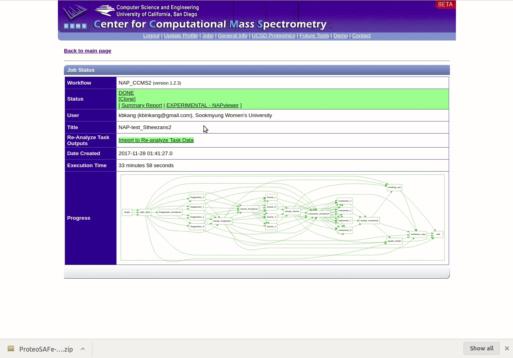

## Network Annotation Propagation Overview

Network Annotation Propagation (NAP) uses spectral networks to propagate information from spectral library matching, in order to improve in silico fragmentation candidate structure ranking. This workflow is currently in beta development stages so any feedback is welcome to improve analysis and usability. It is available [here](https://proteomics2.ucsd.edu/ProteoSAFe/?params={%22workflow%22:%22NAP_CCMS2%22}) under 'NAP_CCMS' Workflow drop down menu.

Check out the full [documentation](https://ccms-ucsd.github.io/GNPSDocumentation/nap/).

## NAP's parameter file 

The ProteoSAFe parameter files are xml files encoding the parameter of the workflows. NAP's parameter file ([example](https://raw.githubusercontent.com/computational-chemical-biology/carcara_documentation/master/docs/static/params_nap.xml)) can be obtained from a previous job as shown in the figure below:

## Editing parameter file 

In order to edit the parameter, open it with a text editor and change the parameter values as shown in the figure below:

### Parameter Walkthrough

| Parameter  | Description          | Default |
| ------------- |-------------| -----|
| GNPS job ID | GNPS molecular networking task id. | |
| Number of a cluster index | Any cluster index of a connected component of interest in a Molecular Network. The propagation is limited by the connected component. | |
| Cosine value to subselect inside a cluster | Used to disconnect nodes in very dense molecular networks and decrease the number of nodes to be analyzed. | 0.5 |
| N first candidates for consensus score | Number of candidate structures of the neighbor nodes used for Consensus re-ranking. | 10 |
| Use fusion result for consensus | Whether to use the result from Fusion re-ranking to perform Consensus re-ranking. | 1 |
| Accuracy for exact mass candidate search (ppm) | Accuracy used for structure database search. The predicted neutral mass (for a given adduct selected) is compared to the exact mass of the structures provided. | 15 |
| Acquisition mode | Mass spectrometry acquisition mode. | Positive |
| Adduct ion type | Expected adduct type for the precursor ion mass. | [M+H] |
| Multiple adduct types | Input one or more adducts, separated by ",". Available options are: listed on the Adduct drop down menu. | |
| Structure databases | Input one or more databases, separated by ",". Available options are: [GNPS](https://gnps.ucsd.edu/ProteoSAFe/libraries.jsp), [HMDB](http://www.hmdb.ca/), [SUPNAT](http://bioinf-applied.charite.de/supernatural_new/index.php), [CHEBI](https://www.ebi.ac.uk/chebi/), [DRUGBANK](https://www.drugbank.ca/) and [FooDB](http://foodb.ca/). Use none to select only user defined. | |
| Compound class to be selected | ClassyFire class in the following format: "class:name". | |
| User provided database | In house candidate structure database to be used in the search. | |
| Skip parent mass selection | Should be used only in combination with class selection. | 0 |
| User provided MetFrag parameter file | Check [here](https://github.com/DorresteinLaboratory/NAP_ProteoSAFe/blob/master/nap_ccms2/Snap/sl_mock_parameter.txt) for a template. | |
| Maximum number of candidate structures in the graph: | Number od candidate structures to be exported in the Cytoscape graph. | 10 |
| Workflow type | [Standard](networking.md) or [MZmine](featurebasedmolecularnetworking.md). | |

