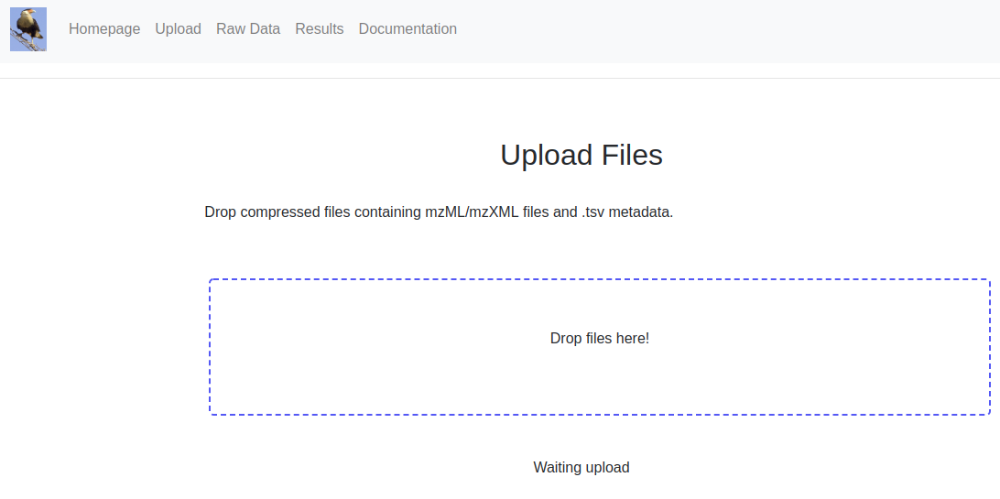
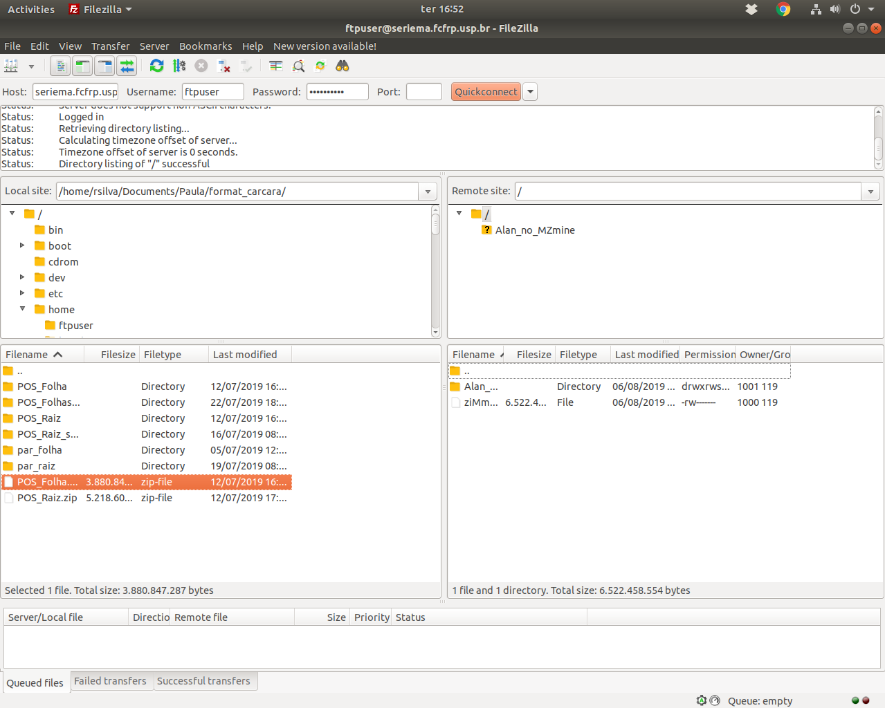

## Data upload 

There are basically two ways to upload data for Carcará. Drag and drop, suitable for small projects, and FTP transfer, for larger projects.

### Drag and drop 

A compressed file (**.zip IS REQUIRED**) can be uploaded in the [Drag and drop area](http://seriema.fcfrp.usp.br:5000/upload), as shown below:



### FTP transfer 

Alternatively, the data can be transferred by an FTP client (**.zip IS REQUIRED**). The data is stored in a common account and automatically transferred to [Raw Data](http://seriema.fcfrp.usp.br:5000/raw_data) page on Carcará:



The credentials for the shared FTP account are:

```
Host: seriema.fcfrp.usp.br
Username: ftpuser
Password: menosfrota
```
